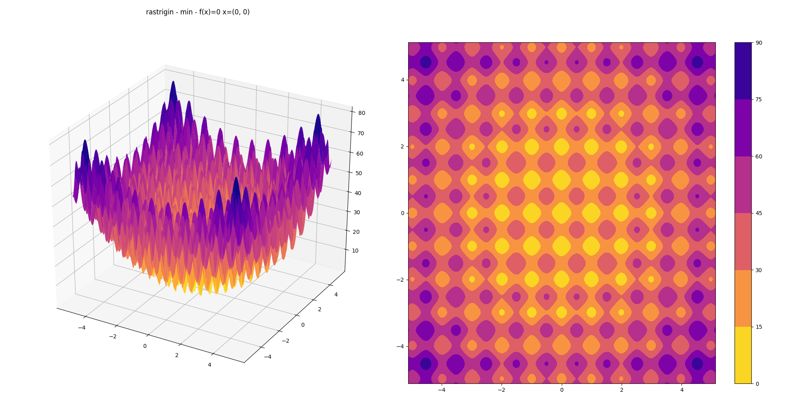

# Evolutionary Optimization

An implementation of two evolutionary algorithms:

- `simple` -- uses best mean from previous generation (single sample) with a constant, diagonal covariance,
- `cma` -- wrapper around `cma.CMAEvolutionStrategy` from [pycma](https://github.com/CMA-ES/pycm://github.com/CMA-ES/pycma).

Four 2D optimization problems taken from [DEAP Benchmarks](https://deap.readthedocs.io/en/master/api/benchmarks.html) are solved -- `sphere`, `schwefel`, `h1` & `rastrigin`.

## The Rastrigin Optimization Problem



### CMAES 


### SimpleSolver 


## Use

```shell-session
$ python main.py h1 cma
$ python main.py rastrigin simple
```

Plot 3D surfaces for all problems -- saves into `./figs/*.png`:

```shell-session
$ python plotting.py
```

## Setup

Python 3.6.8 or above:

```shell-session
$ pip install -r requirements.txt
```

## References

[A Visual Guide to Evolution Strategies](http://blog.otoro.net/2017/10/29/visual-evolution-strategies)

[DEAP Benchmarks](https://deap.readthedocs.io/en/master/api/benchmarks.html)

[pycma](https://github.com/CMA-ES/pycm://github.com/CMA-ES/pycma)
