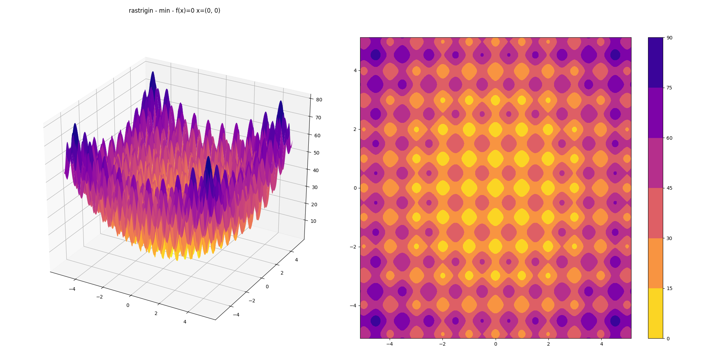

# Evolutionary algorithms



*The rastrigin optimization problem*


*CMAES on rastrigin*


*SimpleSolver on rastrigin*

A simple library with two evolutionary algorithms:
- `simple` - $(1, \lambda)$-ES - uses best mean from previous generation (ssingle sample), constant & dialogal covariance
- `cma` - CMA-ES - wrapper around `cma.CMAEvolutionStrategy` from [pycma](https://github.com/CMA-ES/pycm://github.com/CMA-ES/pycma)

There are four 2D optimization problems taken from [DEAP Benchmarks](https://deap.readthedocs.io/en/master/api/benchmarks.html):
- `sphere`
- `schwefel`
- `h1`
- `rastrigin`

## Setup

Developed on Python 3.6.8.  Install dependencies using `requirements.txt`:

```bash
pip install -r requirements.txt
```

## Use

```bash
python main.py h1 cma

python main.py rastrigin simple
```

Plot 3D surfaces for all problems - saves into `./figs/*.png`

```bash
python plotting.py
```

## References

[A Visual Guide to Evolution Strategies](http://blog.otoro.net/2017/10/29/visual-evolution-strategies)

[DEAP Benchmarks](https://deap.readthedocs.io/en/master/api/benchmarks.html)

[pycma](https://github.com/CMA-ES/pycm://github.com/CMA-ES/pycma)
